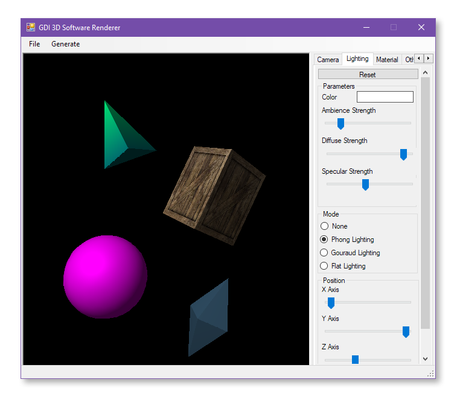
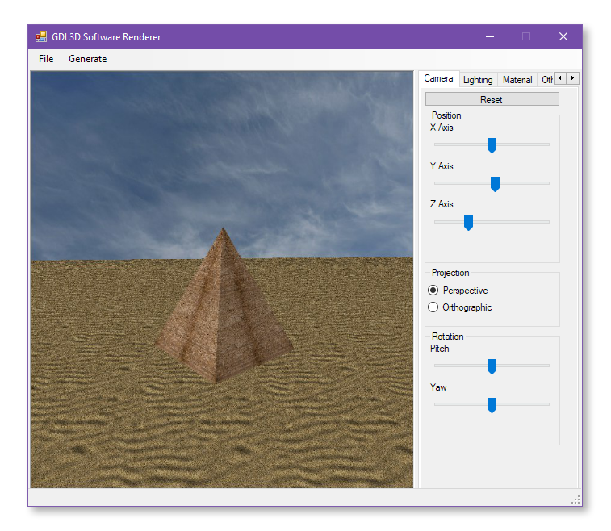

# gdi-3d-renderer

A simple software renderer for 3D graphics written in Visual C++ (Windows only). Everything is implemented from scratch (literally, from the `putPixel` function), including:

- Vector/matrix manipulations
- Orthographic/perspective projections
- Affine transformations
- Camera manipulations
- Lighting and materials
- Flat/Gouraud/Phong shading
- Textures (with OpenGL-like wrapping mode)
- Wireframe/solid modes
- Primitives (cube, sphere, etc.)

You can add, manipulate and remove 3D objects on the scene. Some primitives are pre-generated (under the _Generate_ menu), others you can load from `.object` files. You can find some example objects under `GDIRenderer/objects`.

This project is licensed under the [MIT License](./LICENSE).

## Disclamer

The app was written as a university project in 2018 for the computer graphics course. If you're studying computer graphics or OpenGL, you might find this useful, however I don't update or maintain it.

## Building

Run the `.sln` file in Visual Studio and choose **Build - Build Solution**.

The resulting `.exe` file will be generated under `x64/Debug/` (or `x64/Release/`).

## Screenshots

